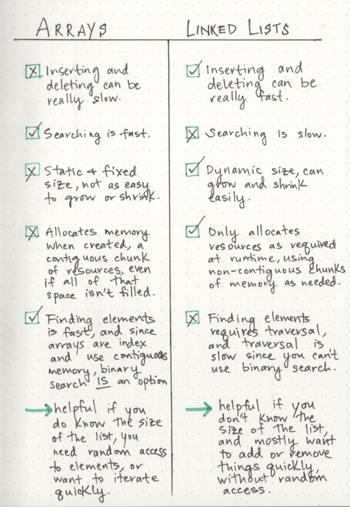

## Linked List

Linked List is a linear data structure where each element is a seperate object. Each element (or node) of a list comprises of two items - data and reference to next node. The last node has reference to null.


#### Advantages
```
-> Can be expanded in O(1) i.e constant time 
-> Does not require one block allocation. One can start with space for just one element
```

#### Disadvantages
```
-> Takes O(n) time to access element in worst case
-> Cannot take advantage of modern CPU caching methods as there is no special locality in memory
-> Hard to manipulate
-> Extra memory space required for pointers
```


## Arrays

#### Advantages
```
-> Constant access time i.e O(1)
-> Simple and easy to use
```

#### Disadvantages
```
-> Fixed size
-> One block allocation
-> Complex position based insertion
```

## Arrays vs Linked Lists


## Linked List Implementations

### [Singly Linked List](LinkedList.java)

Methods | Description | Time Complexity
--- | --- |:---:|
`addFirst(E data)                `| Add element to beginning of list  | O(1)     
`addLast(E data) or add(E data)  `| Add element to the end of list    | O(n)
`add(int index, E data)          `| Add element at index (zero based) | O(n)     
`removeFirst() or remove()       `| Remove element from beginning of list | O(1)
`removeLast()                    `| Remove element from end of list   | O(n)
`remove(int index)               `| Remove element from index (zero based) | O(n)
`removeAll()                     `| Remove all elements               | O(1)
`size()                          `| Returns size of list              | O(1)
`isEmpty()                       `| Checks whether list is empty      | O(1)


### [Doubly Linked List](DoublyLinkedList.java)

Methods | Description | Time Complexity
--- | --- | :---:
`addFirst(E data)                `| Add element to beginning of list  | O(1)     
`addLast(E data) or add(E data)  `| Add element to the end of list    | O(n)
`add(int index, E data)          `| Add element at index (zero based) | O(n)     
`removeFirst() or remove()       `| Remove element from beginning of list | O(1)
`removeLast()                    `| Remove element from end of list   | O(n)
`remove(int index)               `| Remove element from index (zero based) | O(n)
`removeAll()                     `| Remove all elements               | O(1)
`size()                          `| Returns size of list              | O(1)
`isEmpty()                       `| Checks whether list is empty      | O(1)


### [Circular Linked List](CircularLinkedList.java)

Methods | Description | Time Complexity
--- | --- | :---:
`addFirst(E data)                `| Add element to beginning of list  | O(n)     
`addLast(E data) or add(E data)  `| Add element to t
he end of list    | O(n)
`add(int index, E data)          `| Add element at index (zero based) | O(n)     
`removeFirst() or remove()       `| Remove element from beginning of list | O(n)
`removeLast()                    `| Remove element from end of list   | O(n)
`remove(int index)               `| Remove element from index (zero based) | O(n)
`removeAll()                     `| Remove all elements               | O(1)
`size()                          `| Returns size of list              | O(1)
`isEmpty()                       `| Checks whether list is empty      | O(1)

### [XOR Linked List](http://www.linuxjournal.com/article/6828)
Also known as memory efficient linked list. In conventional implementation, we need to keep a forward pointer to next node on the list and a backward pointer to the previous node. XOR linked list implementation is based on pointer difference. Each node uses only one pointer to traverse the list back and forth. 

**Note:** XOR operation is not permitted on references in Java

