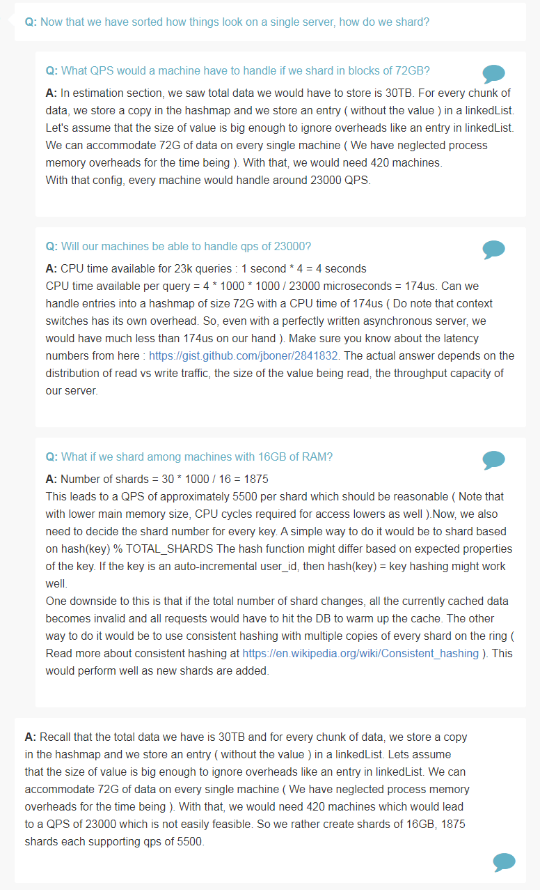
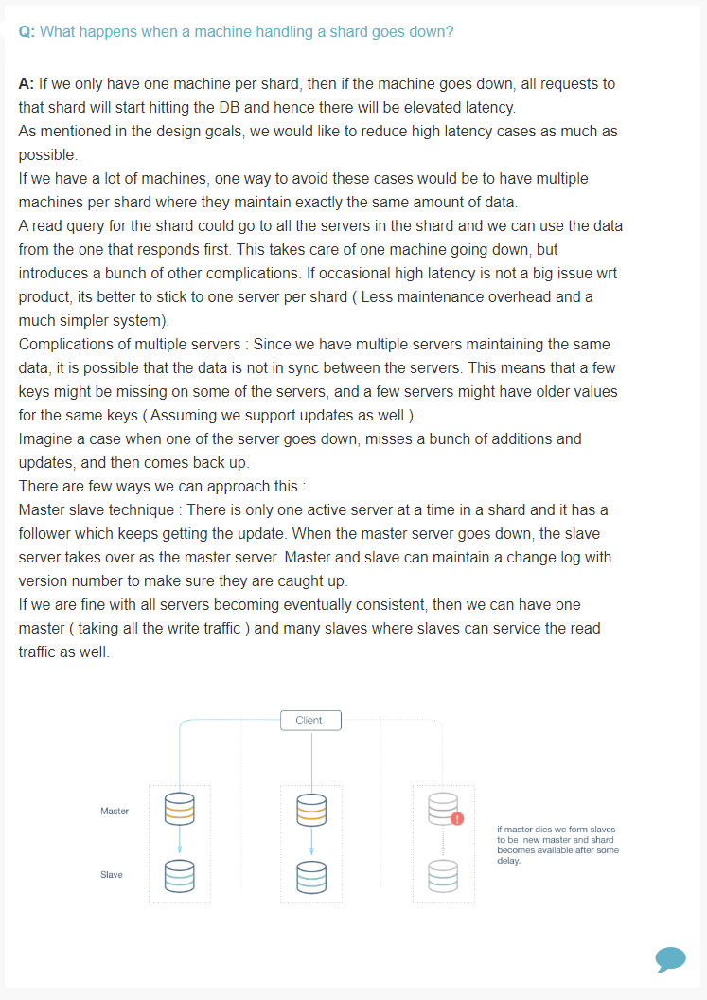

## Design Cache

Features
========
> What is the amount of data that we need to cache?

> What would be our eviction strategy?

> What should be the access pattern for the given cache?

Estimation
==========

> What kind of queries per second (QPS) we expect for the system?

> What is the number of machines required to cache?

Design Goals
============

> Is latency very important metric for us?

> Consistency vs Availability?

Deep Dive
=========

> How would a LRU cache work on a single machine which is single threaded?

> What if we never had to remove entries from the LRU cache because we had enough space, what would you use to support and get and set?

> How should we modify our approach if we also have to evict keys at some stage?

> How would a LRU cache work on a single machine which is multithreaded?

> How would you break down a cache write and read into multiple instructions?

> How would you prioritize above operations to keep latency to a minimum for our system?

> How would you implement HashMap?

> Now that we have sorted how things look on a single server, how do we shard?

> What QPS would a machine would have to handle if we shard in blocks of 72 GB?

> Will our machine be able to handle QPS of 23000?
.
> What if we shard among machines with 16GB of RAM?

> What happens when a machine handling a shard goes down?

References
==========
* [LRU Cache - Leetcode](https://leetcode.com/problems/lru-cache/discuss/45911/Java-Hashtable-+-Double-linked-list-(with-a-touch-of-pseudo-nodes))
* [Latency Numbers that programmers should know](https://gist.github.com/jboner/2841832)
* [Consistent Hashing](https://en.wikipedia.org/wiki/Consistent_hashing)
* [LRU Cache - Interview Bit](https://www.interviewbit.com/problems/lru-cache/)