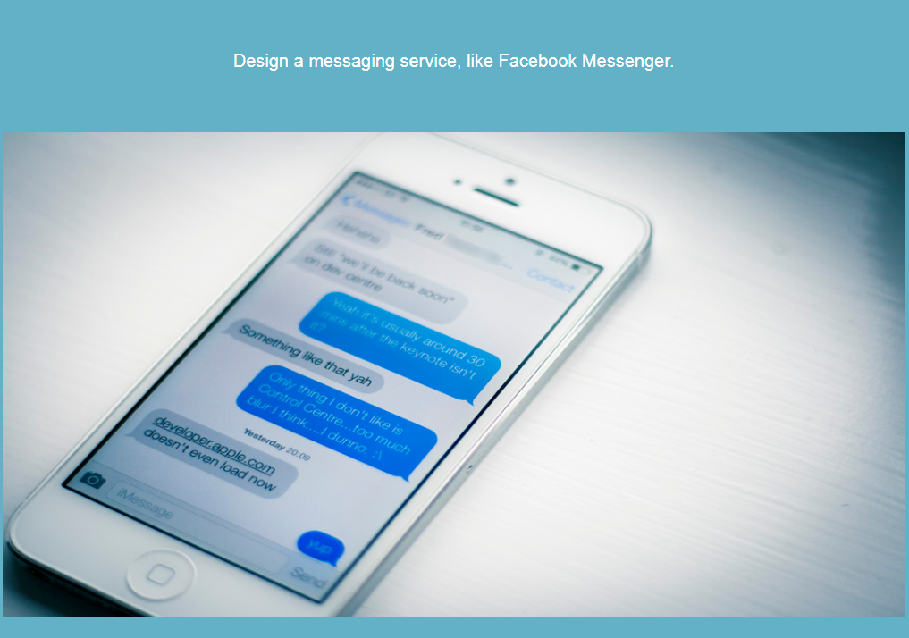
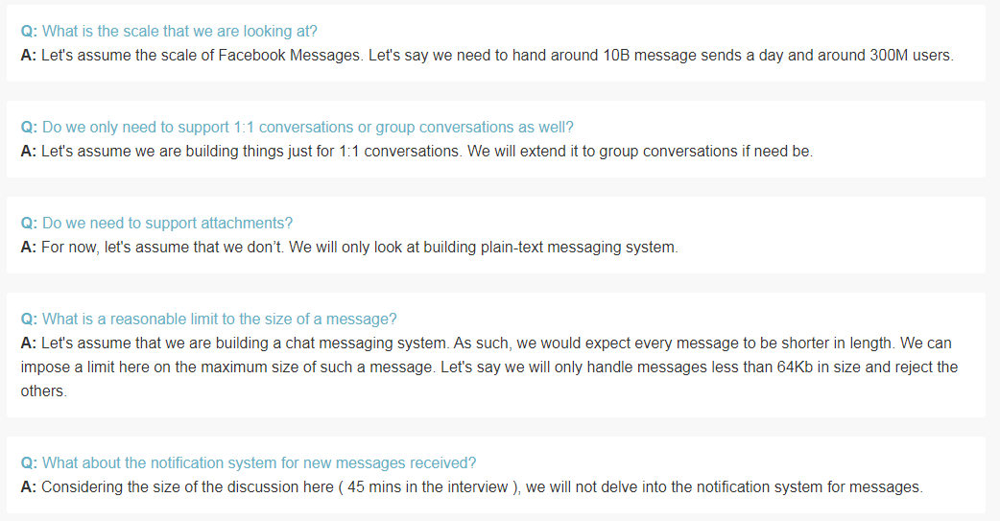
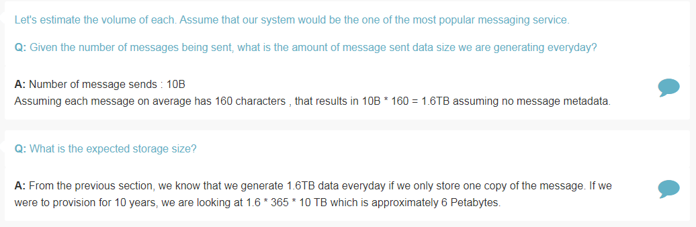
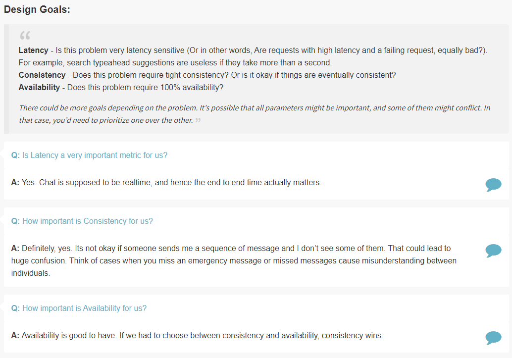
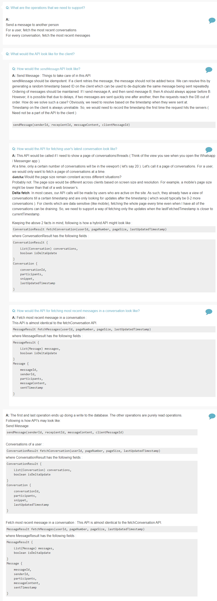
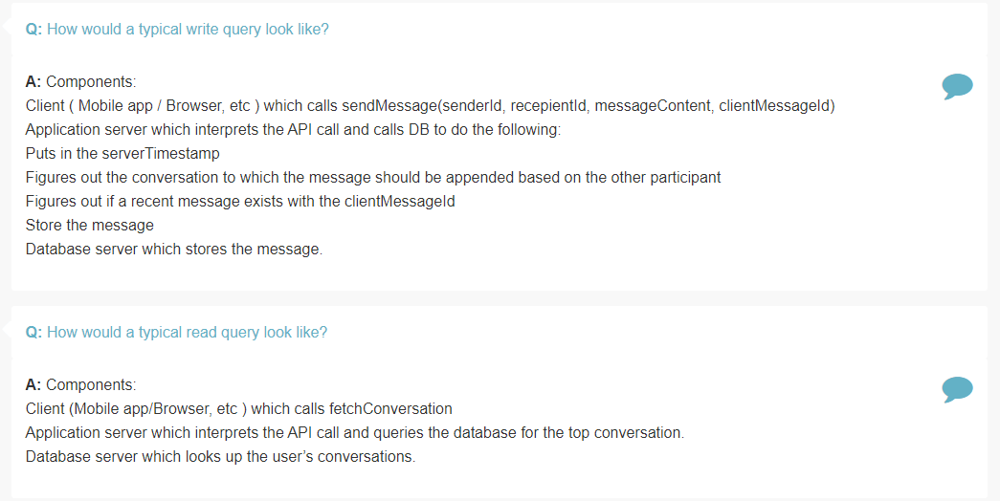
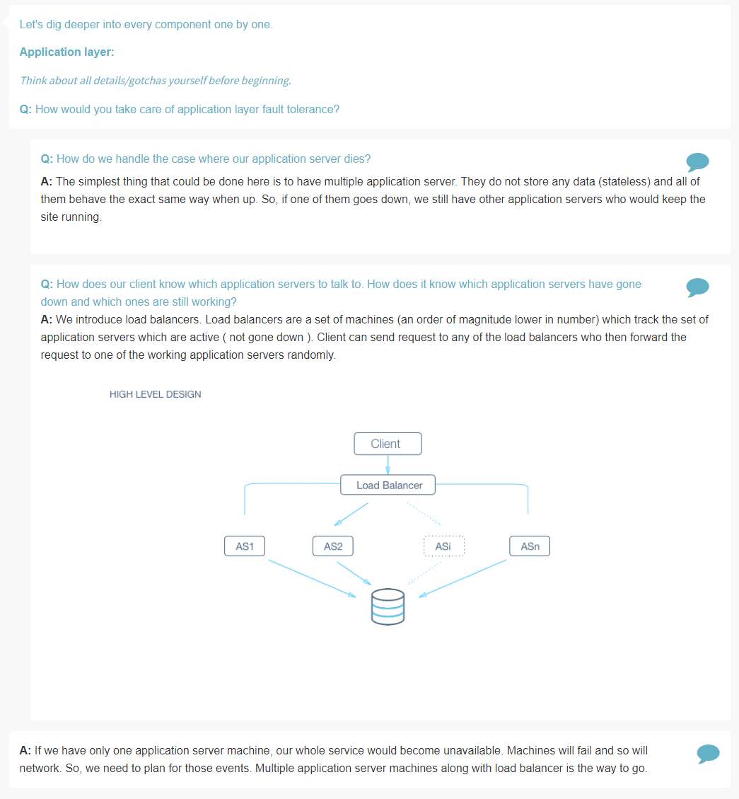
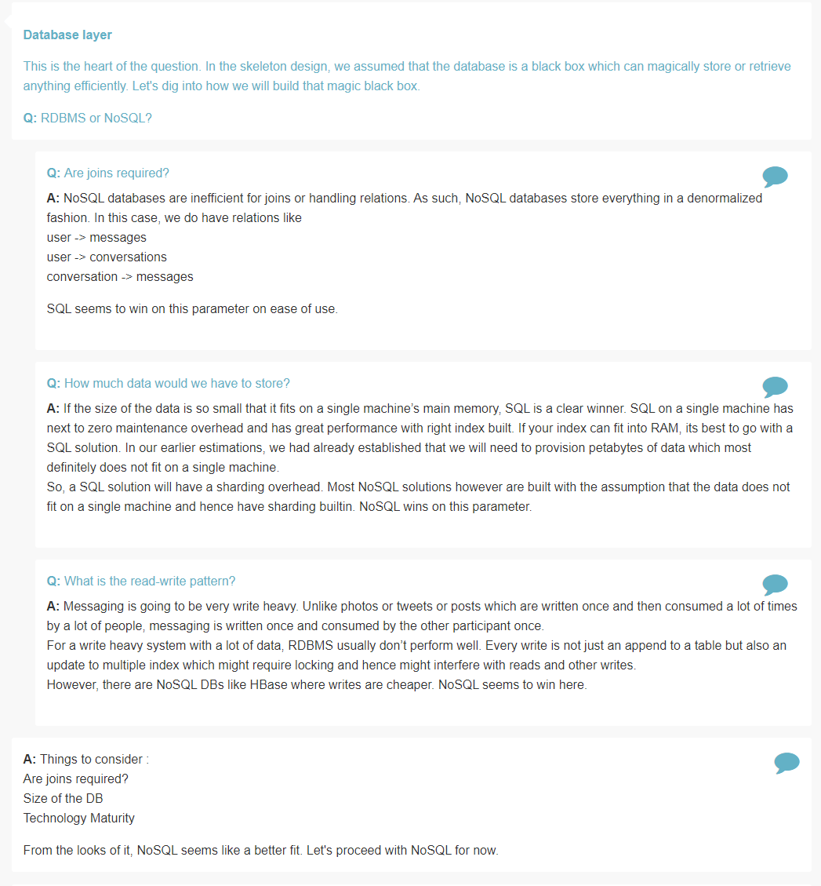
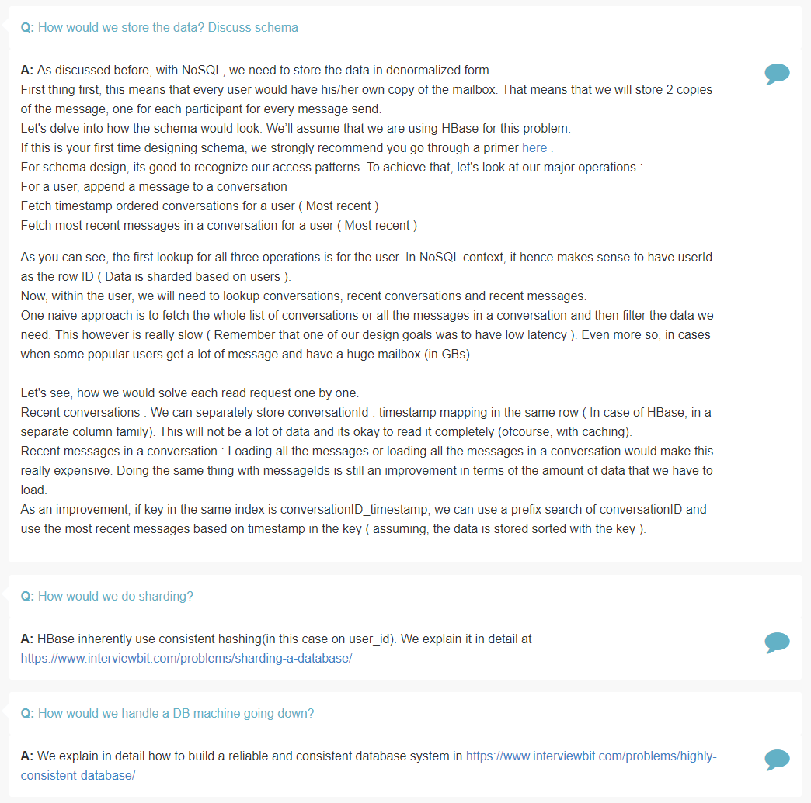
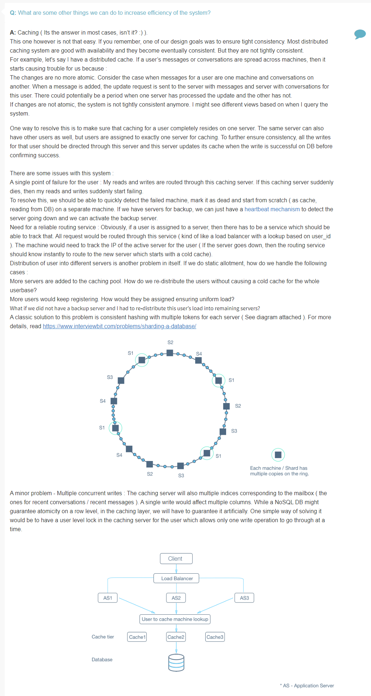

## Design Messenger

Features
========

> What is the scale that we are looking at? 

> Do we only need to support 1:1 conversations or group conversations as well? 

> Do we need to support attachments?

> What is a reasonable limit to the size of a message? 

> What about the notification system for new messages received? 

Estimation
==========

> Given the number of messages being sent, what is the amount of message sent data size we are generating everyday?

> What is the expected storage size?

Design Goals
============

> Is Latency a very important metric for us?

> How important is Consistency for us?

> How important is Availability for us?

Skeleton of the Design
======================

> What are the operations that we need to support?

> What would the API look like for the client?

> How would the sendMessage API look like?

> How would the API for fetching user's latest conversation look like?

> How would the API for fetching most recent messages in a conversation look like?

> How would a typical write query look like?

> How would a typical read query look like?

Deep Dive
=========

> How would you take care of application layer fault tolerance?

> How do we handle the case where our application server dies?

> How does our client know which application servers to talk to. How does it know which application servers have gone down and which ones are still working?

> RDBMS or NoSQL?

> Are joins required?

> How much data would we have to store?

> What is the read-write pattern?

> How would we store the data? Discuss schema

> How would we do sharding?

> How would we handle a DB machine going down?

> What are some other things we can do to increase efficiency of the system?

References
==========

* Lookup HBase
* Lookup RDBMS vs No SQL
* [Guidelines for HBase Schema Design](https://www.mapr.com/blog/guidelines-hbase-schema-design)
* [Heartbeat Mechanism](https://searchdatacenter.techtarget.com/definition/Heartbeat)