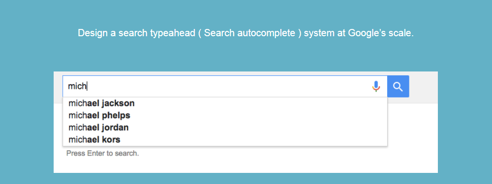
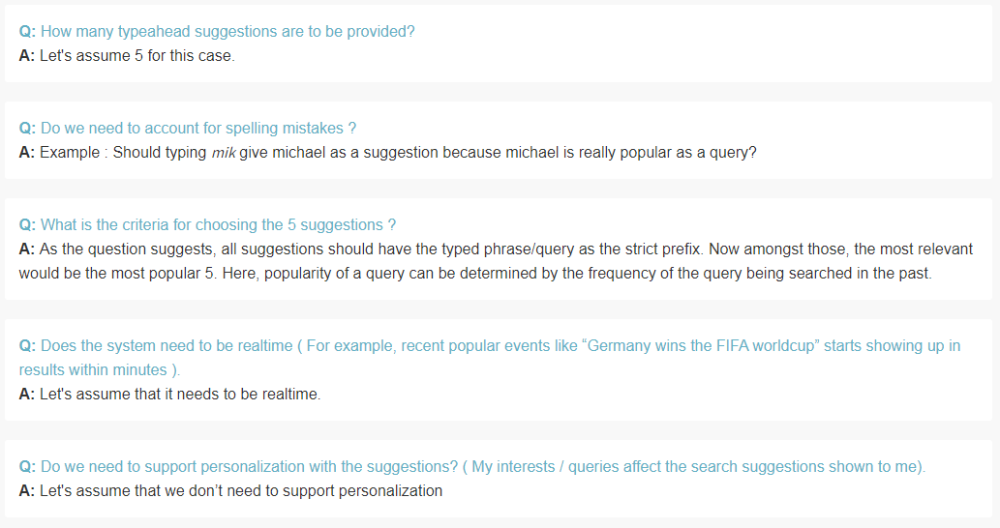
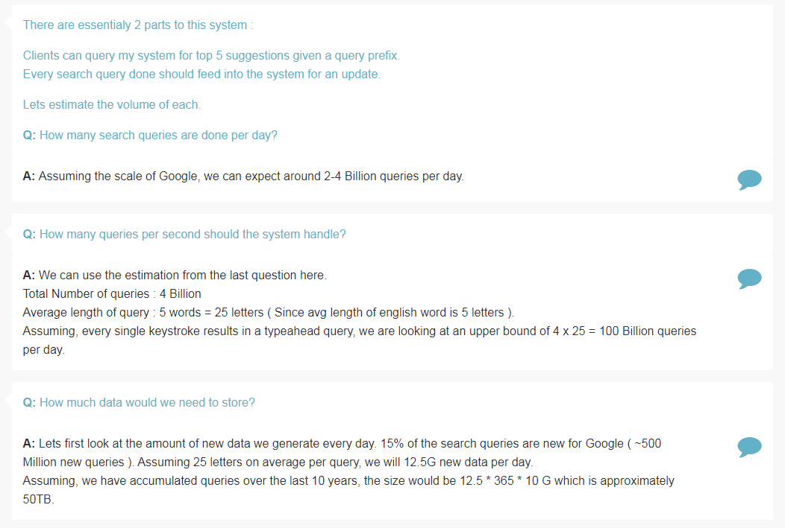
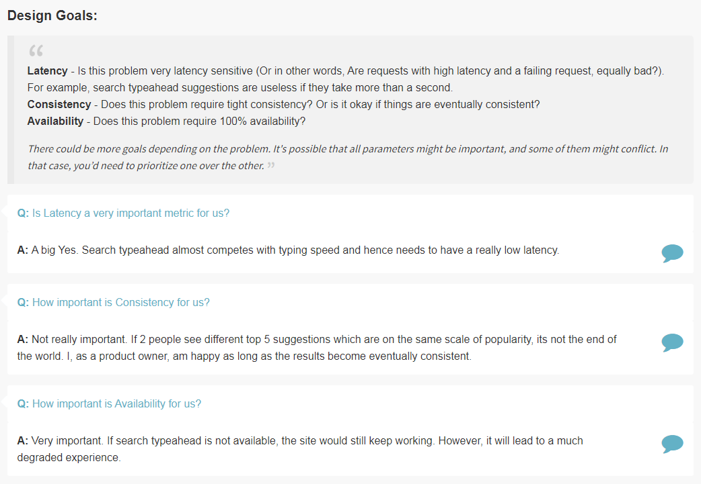
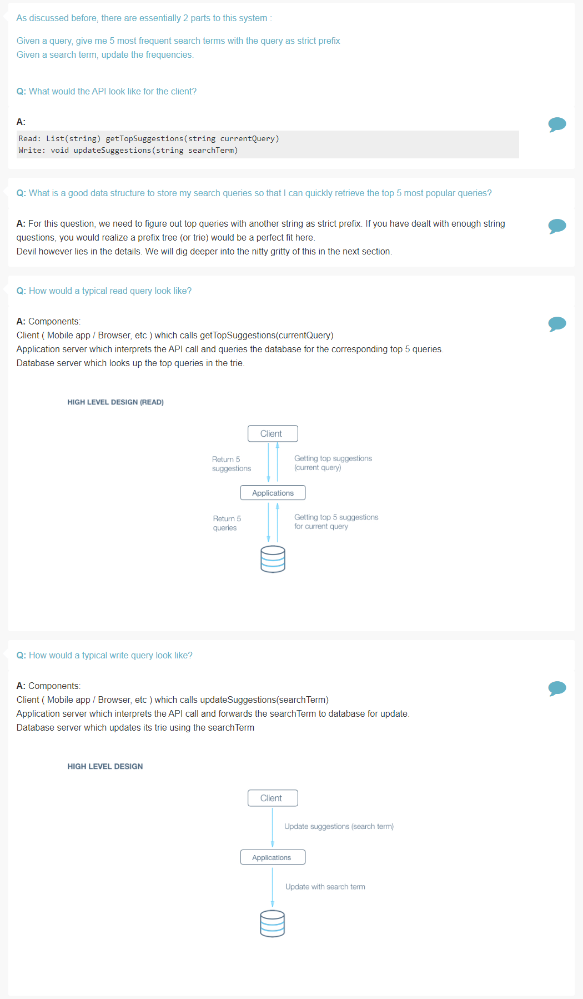
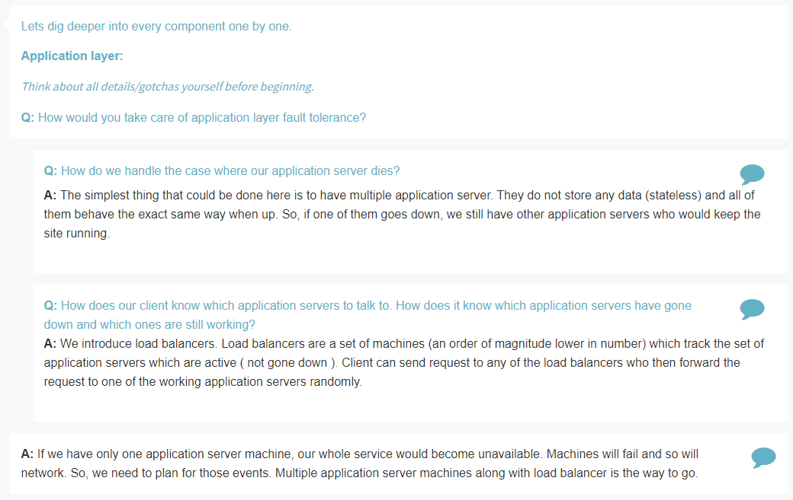
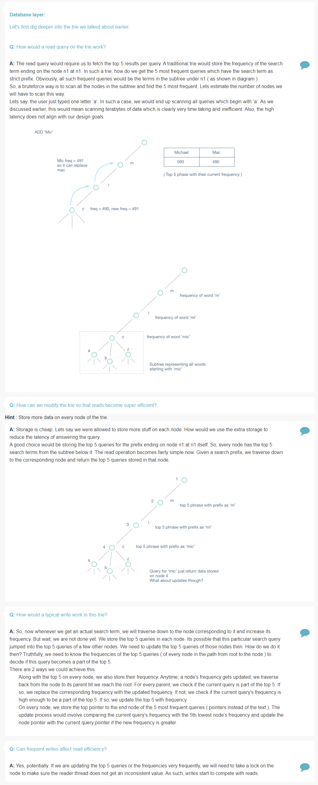
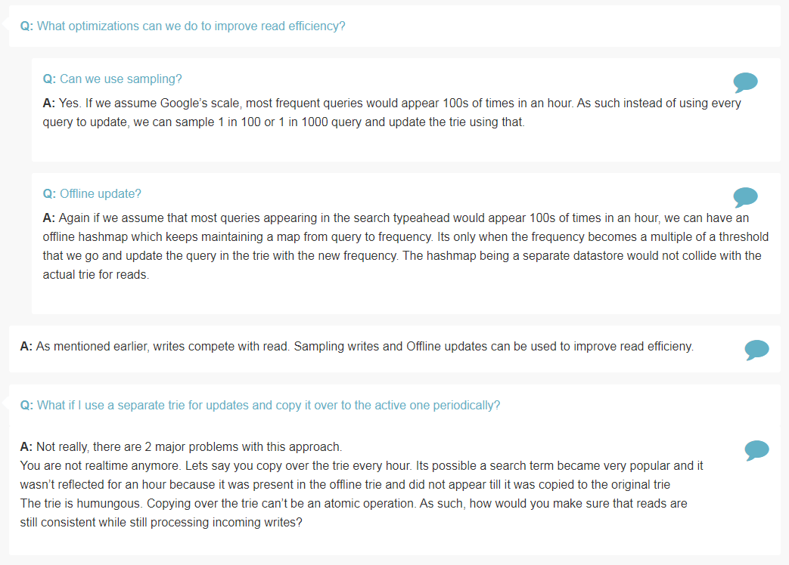
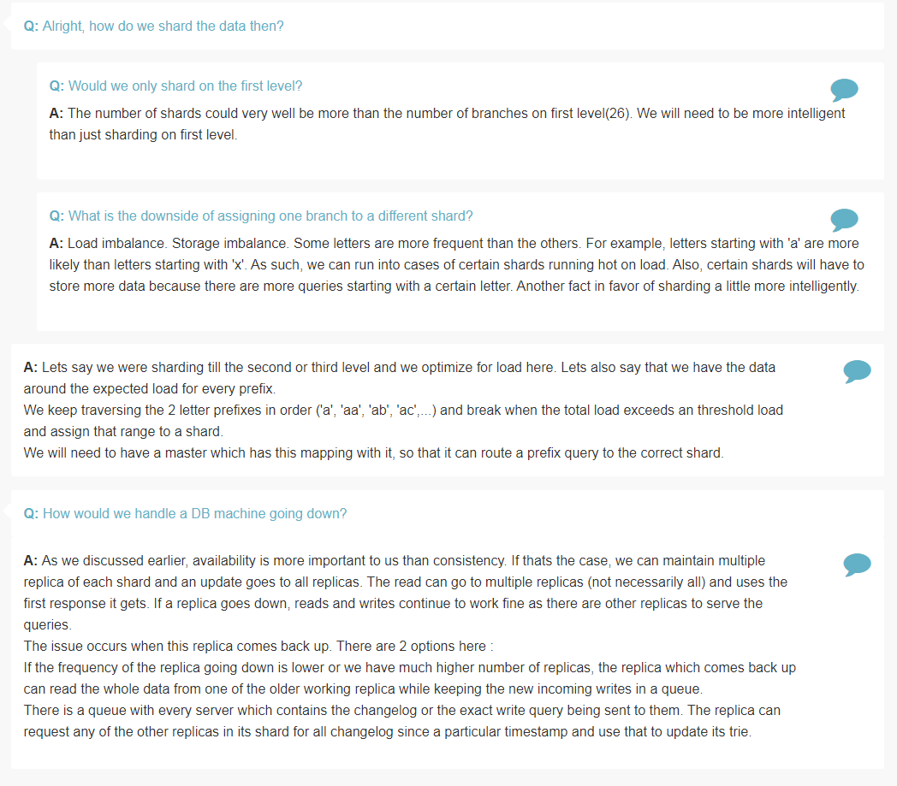

## Design Search Typeahead

Features
========

> How many typeahead suggestions is to be provided?

> Do we need to account for spelling mistakes?

> What is the criteria for choosing 5 suggestions?

> Does the system need to be realtime ( For example, recent popular events like “Germany wins the FIFA worldcup” starts showing up in results within minutes ).

> Do we need to support personalization with the suggestions? ( My interests / queries affect the search suggestions shown to me).

Estimation
==========

> How many search queries are done per day?

> How many queries per second should the system handle?

> How much data would we need to store?

Design Goals
=============

> Is Latency a very important metric for us?

> How important is Consistency for us?

> How important is Availability for us?

Skeleton of Design
==================

> What would the API look like for client?

> What is a good data structure to store my search queries so that I can quickly retrieve the top 5 most popular queries?

> How would a typical read query look like?

> How would a typical write query look like?

Deep Dive
=========

> How would you take care of application layer fault tolerance?

> How do we handle the case where our application server dies?

> How does our client know which application servers to talk to. How does it know which application servers have gone down and which ones are still working?

> How would a read query on the trie work?

> How can we modify the trie so that reads become super efficient?

> How would a typical write work in this trie?

> Can frequent writes affect read efficiency?

> What optimizations can we do to improve read efficiency?

> Can we use sampling?

> Offline update?

> What if I use a separate trie for updates and copy it over to the active one periodically?

> Would all data fit on a single machine?

> Alright, how do we shard the data then?

> Would we only shard on the first level?

> What is the downside of assigning one branch to a different shard?

> How would we handle a DB machine going down?

References
===========
* Lookup Trie