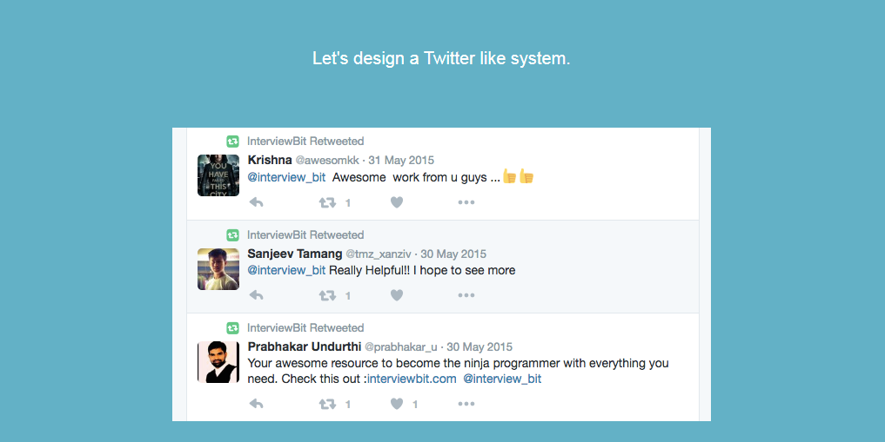
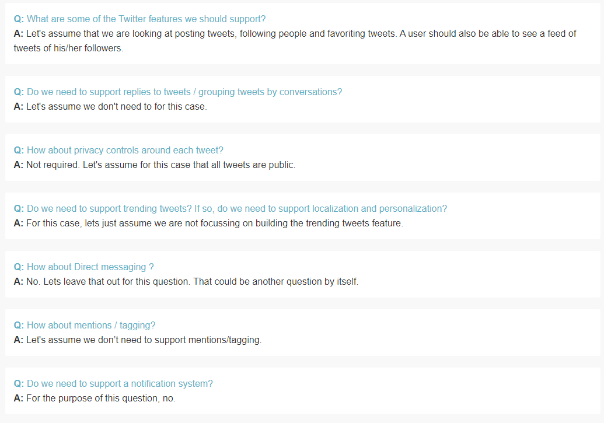
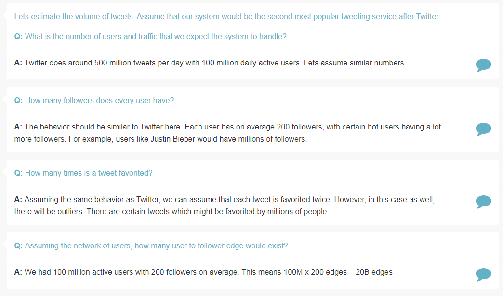
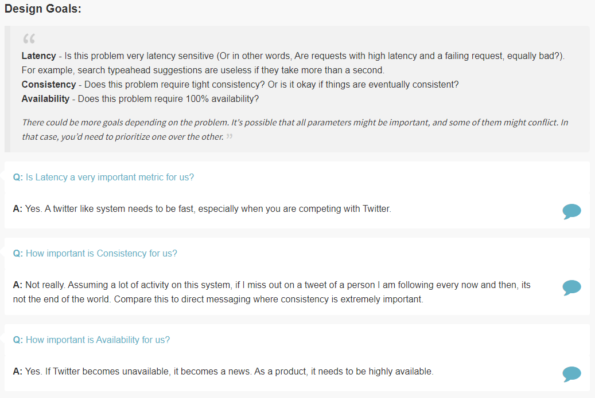
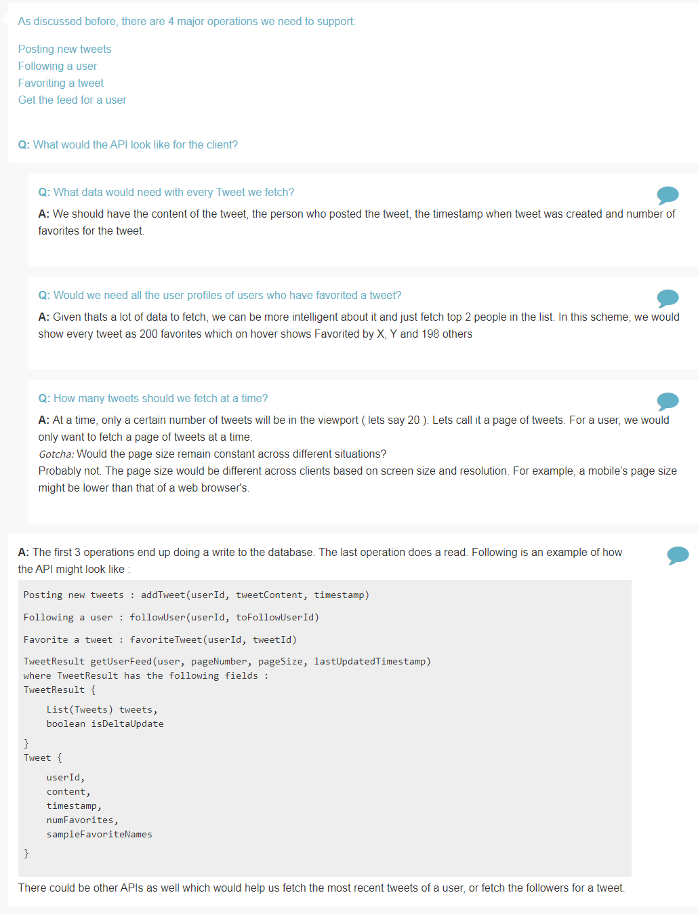
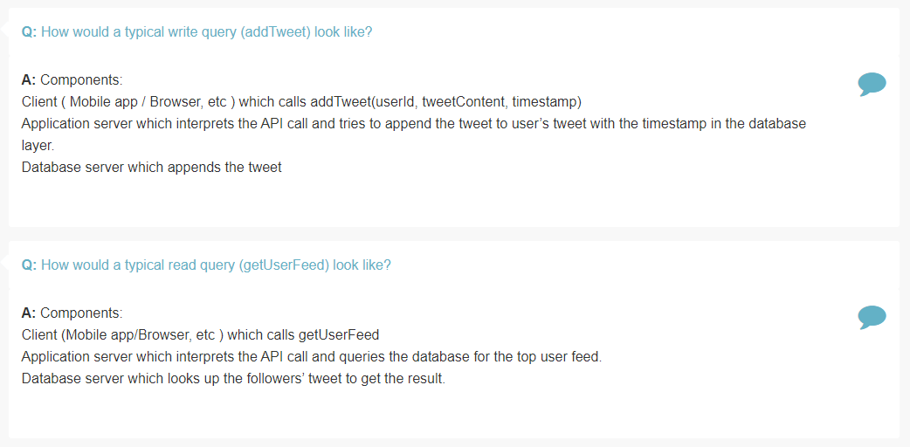
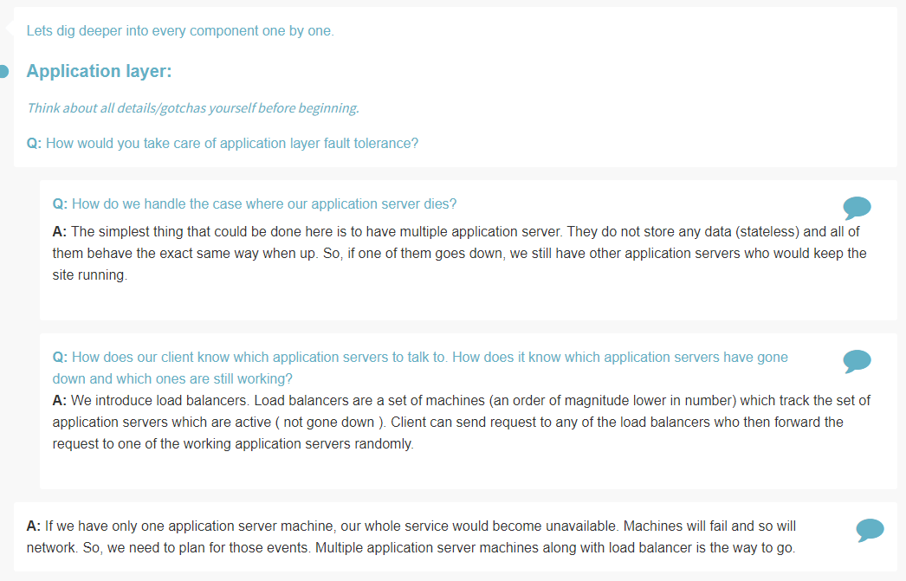
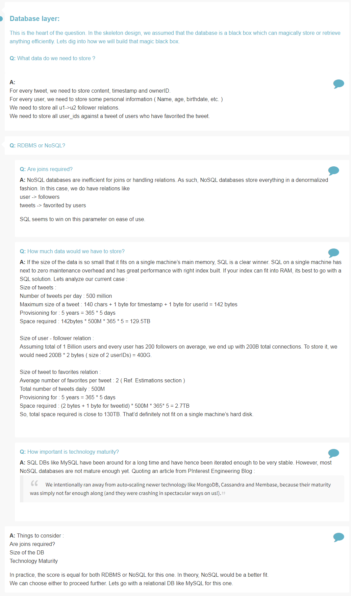
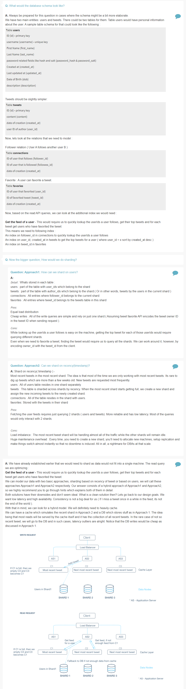
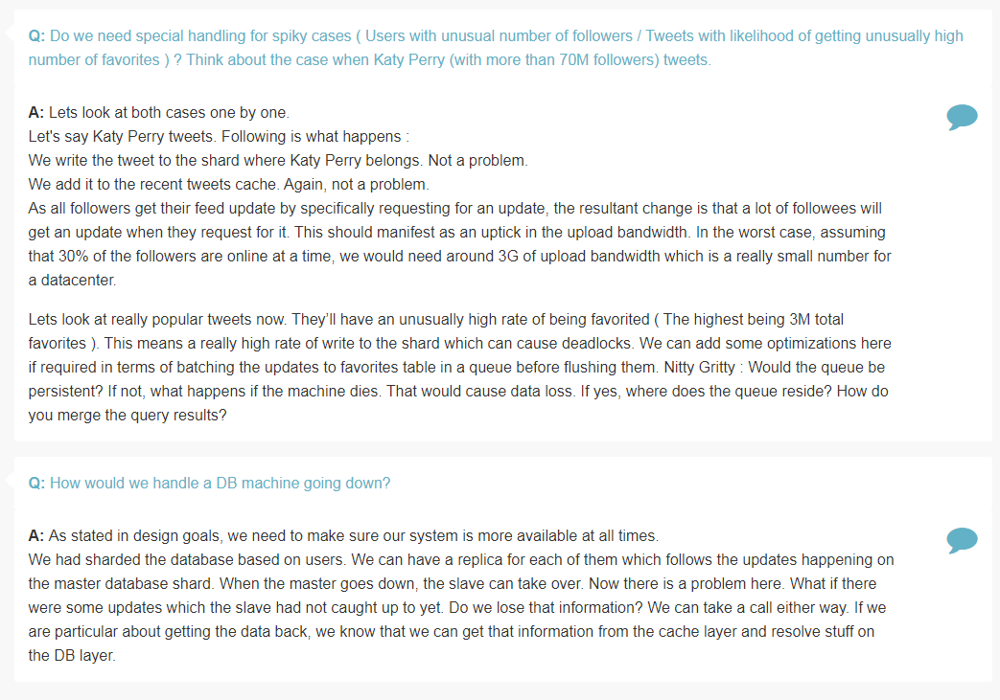

## Design Twitter

Features
========

> What are some of the twitter features we should support?

> Do we need to support replies to tweets / grouping tweets by conversations? 

> How about privacy controls around each tweet? 

> Do we need to support trending tweets? If so, do we need to support localization and personalization? 

> How about Direct messaging ? 

> How about mentions / tagging? 

> Do we need to support a notification system? 

Estimation
==========

> What is the number of users and traffic that we expect the system to handle?

> How many followers does every user have?

> How many times is a tweet favorited?

> Assuming the network of users, how many user to follower edge would exist?

Design Goals
============

> Is Latency a very important metric for us?

> How important is Consistency for us?

> How important is Availability for us?

Skeleton of Design
==================

> What would the API look like for the client?

> What data would need with every Tweet we fetch?

> Would we need all the user profiles of users who have favorited a tweet?

> How many tweets should we fetch at a time?

> How would a typical write query (addTweet) look like?

> How would a typical read query (getUserFeed) look like?

Deep Dive
=========

> How would you take care of application layer fault tolerance?

> How do we handle the case where our application server dies?

> How does our client know which application servers to talk to. How does it know which application servers have gone down and which ones are still working?

> What data do we need to store ?

> RDBMS or NoSQL?

> How much data would we have to store?

> How important is technology maturity?

> What would the database schema look like?

> Now the bigger question, How would we do sharding?

> How can we shard on users?

> Can we shard on recency(timestamp)?

> Do we need special handling for spiky cases ( Users with unusual number of followers / Tweets with likelihood of getting unusually high number of favorites ) ? Think about the case when Katy Perry (with more than 70M followers) tweets.

> How would we handle a DB machine going down?

References
==========
* Lookup Hash
* Lookup Salt
* Lookup NoSQL vs SQL