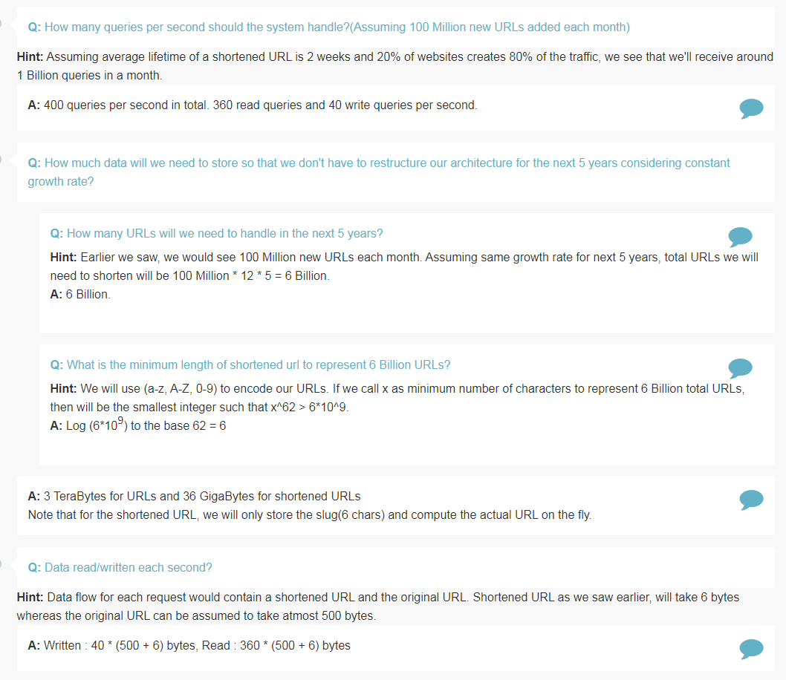
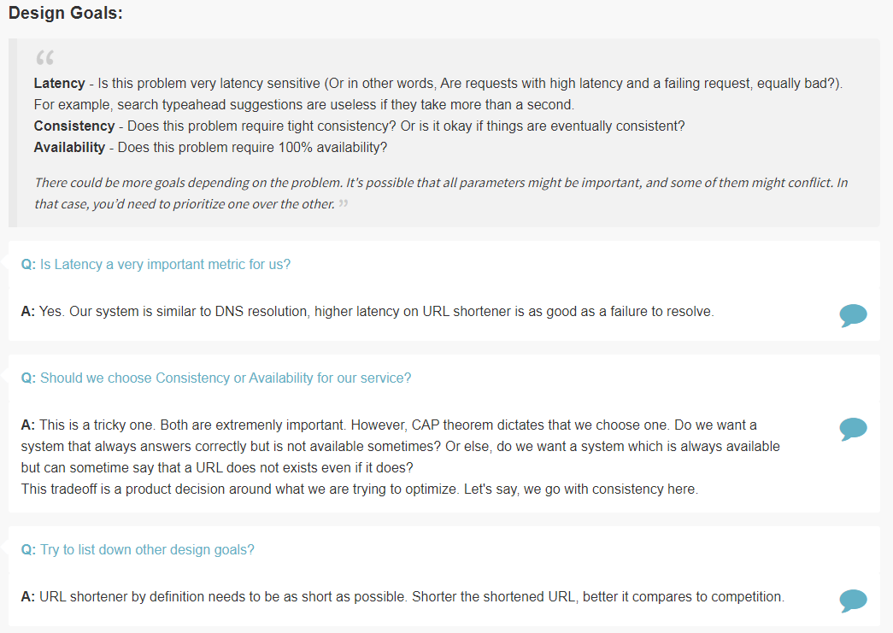
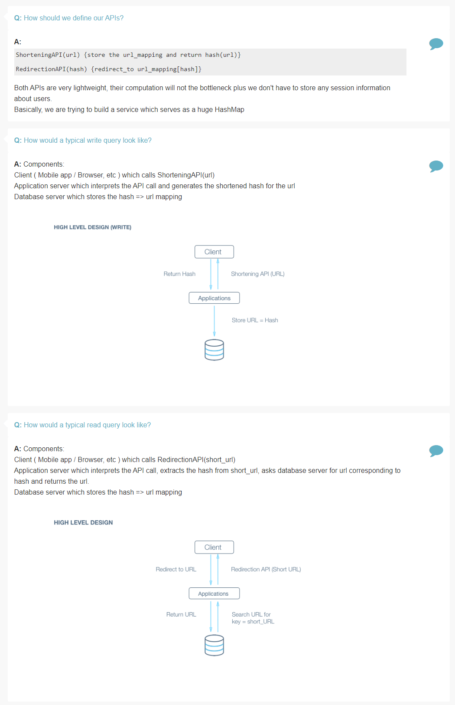
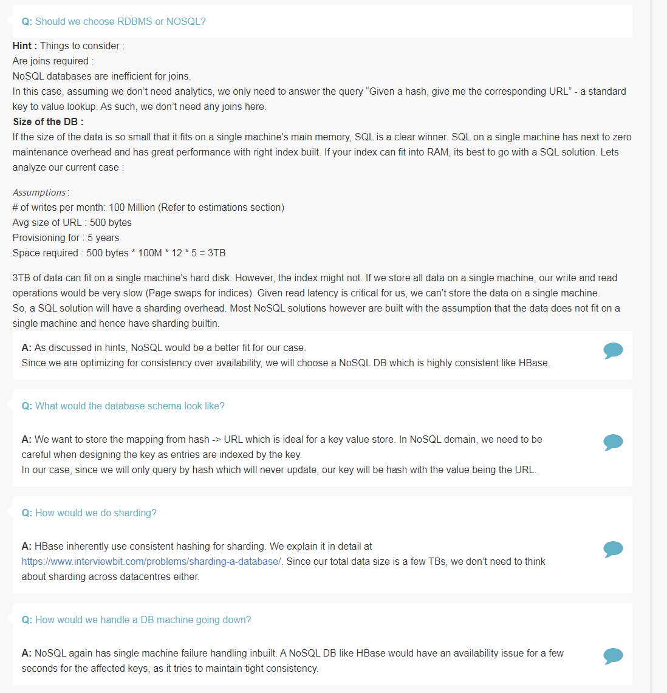
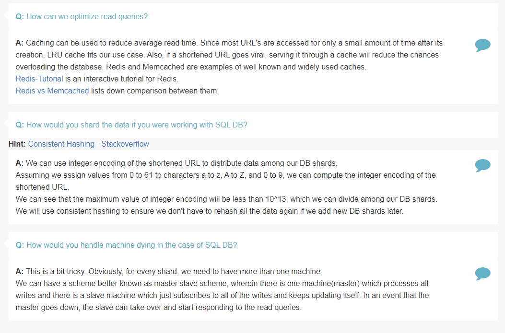

## Design URL Shortener

Features
=========

> Take a url and return a much shorter url

> Take a short url and redirect to the original url

> Custom url

> Analytics

Estimation
==========

> How many queries per second (QPS) should the system handle? (Assuming 100 Million new URLs added each month)

> How much data will we need to store so that we don't have to restructure our architecture for the next 5 years considering constant growth rate?

> How many URLs will we need to handle in next 5 years?

> What is minimum length of shortened url to represent 6 Billion URLs?

> Data read / written each second?

Design Goals
============

> Is latency a very important metric?

> Should be choose Consistency or Availability for our service?
 
> Try to list down other design goals?

Skeleton Design
===============

> How should we define our APIs?

> How would a typical write query look like?

> How would a typical read query look like?

Deep Dive
==========

> How should we compute the hash of a URL?

> How should we handle the case where two separate URL gets shortened to the same URL?

> How should you take care of application layer fault tolerance?

> How do we handle the case where our application server dies?

> How does our client know which application servers to talk to. How does it know which application servers have gone down and which one are still working?

> What all data should we store?

> Should we choose RDBMS or NoSQL?

> What would the database schema look like?

> How would we do sharding?

> How would we handle DB machine going down?

> How can we optimize read queries?

> How would you shard the data if you were working with SQL DB?

> How would you handle machine dying in case of SQL DB?

References
===========
* [MD5](https://en.wikipedia.org/wiki/MD5)
* [Base 62 Conversion - Stack Overflow](http://stackoverflow.com/questions/1119722/base-62-conversion-in-python)
* Lookup HBase
* [Consistent Hashing](https://en.wikipedia.org/wiki/Consistent_hashing)
* [Redis](http://try.redis.io/)
* [Redis vs Memcached](http://stackoverflow.com/questions/10558465/memcached-vs-redis)
* [Distributed Hash Table](https://stackoverflow.com/questions/144360/simple-basic-explanation-of-a-distributed-hash-table-dht)