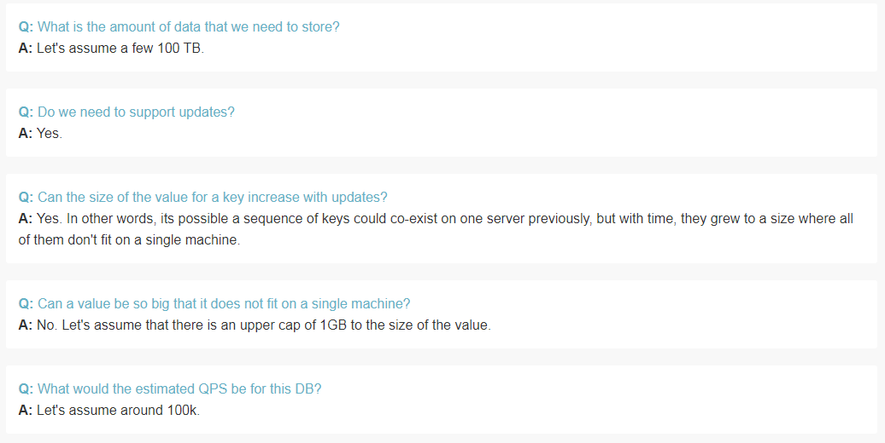
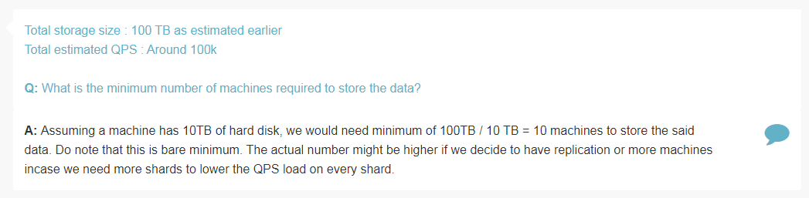
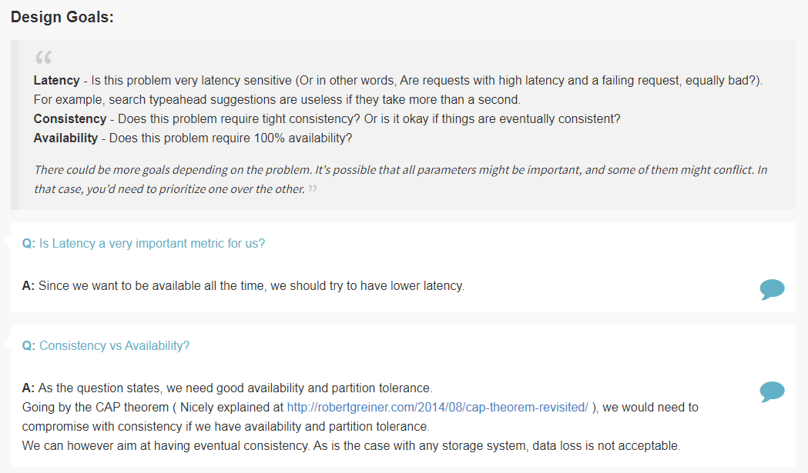
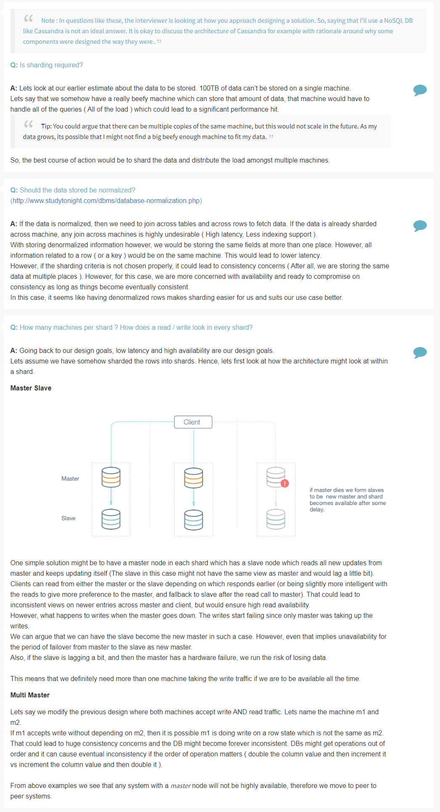
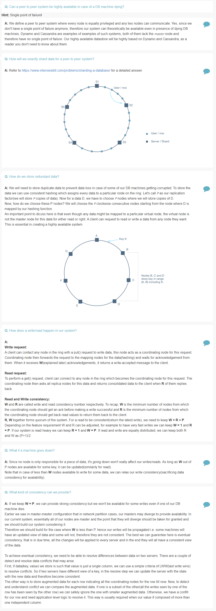

## Highly Available Database

Features
========

> What is the amount of data that we need to store?

> Do we need to support updates?

> Can the size of value for a key increase with updates?

> Can a value be so big that it does not fit on a single machine?

> What would be the estimated QPS for this database?

Estimation
==========

> What is the minimum number of machines required to store the data?

Design Goals
============

> Is latency a very important metric?

> Consistency vs Availability?

Deep Dive
=========

> Is sharding required?

> Should the data store be normalized?

> How many machines per shard? How does a read / write look in every shard?

> Can a peer to peer system be highly available in case of a DB machine dying?

> How do we store redundant data?

> How does read / write happen in our system?

> What if a machine goes down?

> What kind of consistency we can provide?

References
==========
* [CAP Theorem Simplified Explanation](http://ksat.me/a-plain-english-introduction-to-cap-theorem/)
* [CAP Theorem Revisited](http://robertgreiner.com/2014/08/cap-theorem-revisited/)
* [Database Normalization](http://www.studytonight.com/dbms/database-normalization.php)
* Lookup Dynamo
* Lookup Cassandra