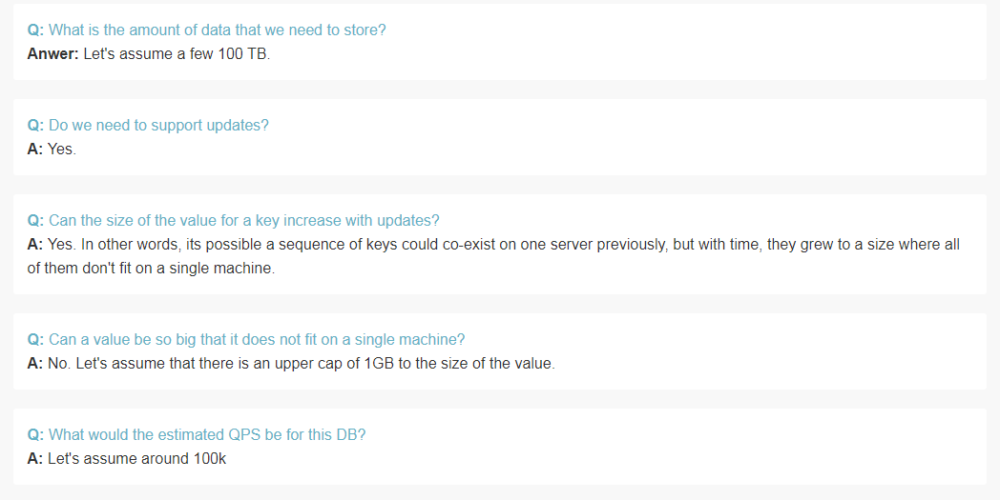
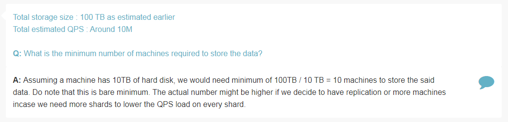
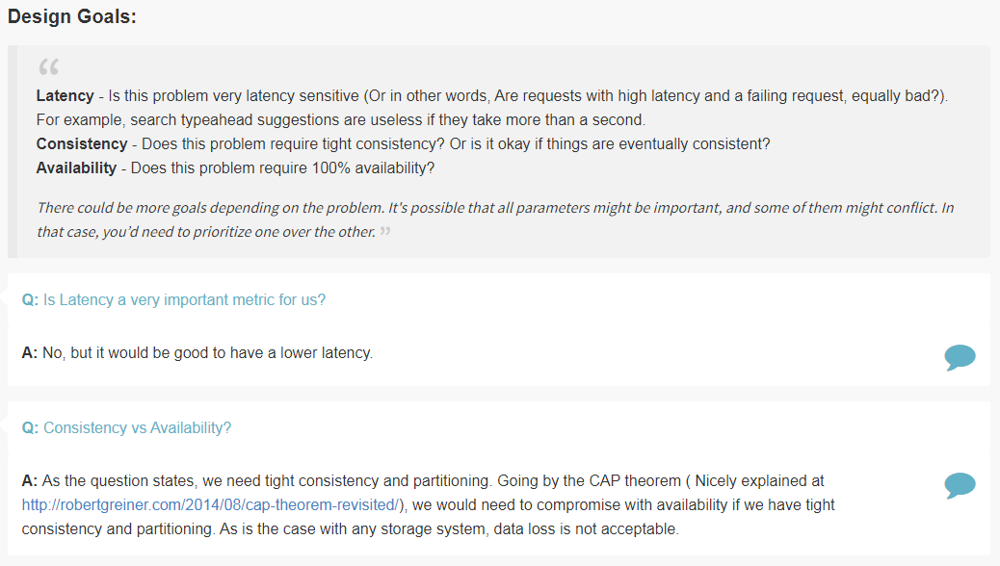
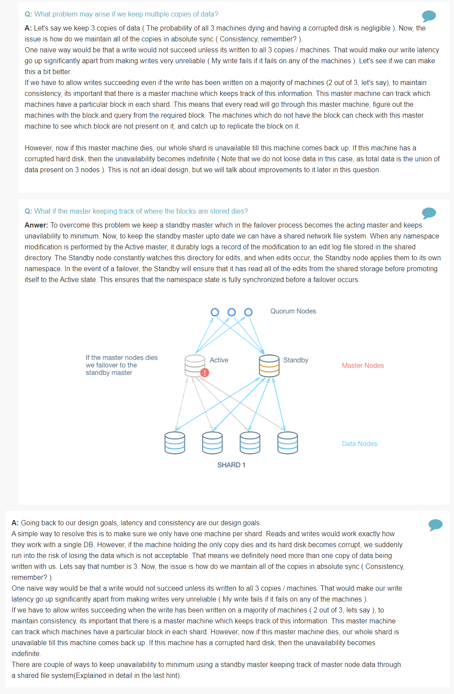

## Highly Consistent Database

Features
========

> What is the amount of data that we need to store?

> Do we need to support updates?

> Can the size of the value for a key increase with updates?

> Can a value be so big that it doesnot fit on a single machine?

> What would be the estimated QPS for this DB?

Estimation
==========

> What is the minimum number of machines required to store the data?

Design Goals
============

> Is latency a very important metric for us?

> Consistency vs Availability?

Deep Dive
=========

> Is sharding required? 

> Should data be normalized?

> How many machines per shard? How does read / write look in every shard?

> Can we keep just one copy of data?

> What problems may arise if we keep multiple copies of data?

> What if master keeping track of where blocks are stored dies?

References
==========
* Lookup HBase