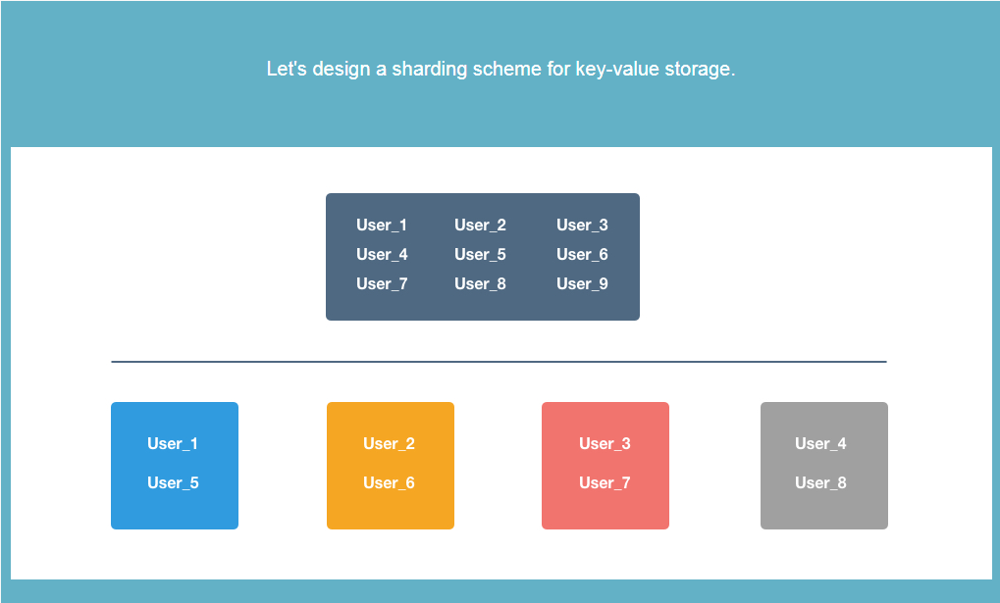
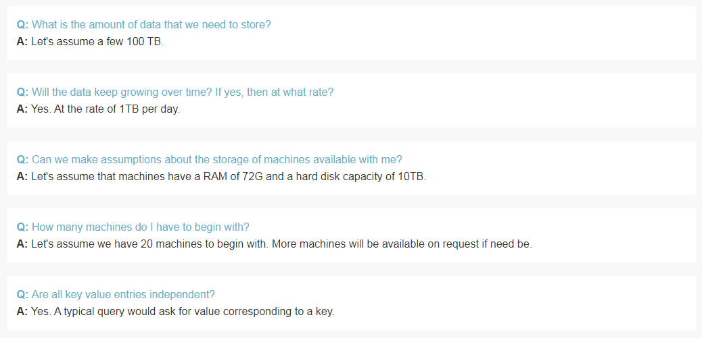
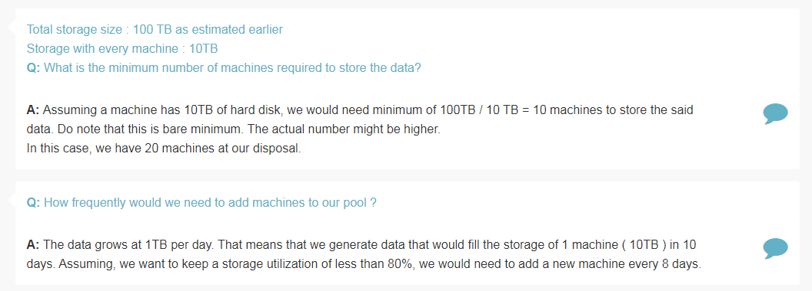
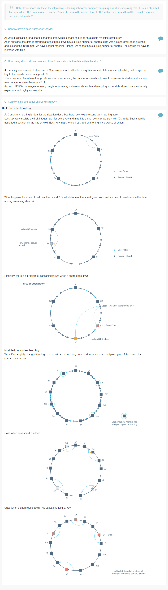

## Sharding a Database

Features
========

> What is the amount of data that we need to store?

> Will the data keep growing over time? If yes, then at what rate?

> Can we make assumptions about the storage of machines available with me?

> How many machines do I have to begin with?

> Are all key value entries independent?

Estimation
==========

> What is the minimum number of machines required to store the data?

> How frequently would we need to add machines to our pool?

Deep Dive
=========

> Can we have fixed number of shards?

> How many shards do we have and how do we distribute the data within the shard?

> Can we think of better sharding strategy?

> How will we exactly shard data for a peer to peer system?

> How do we store redundant data?

References
==========
* [Consistent Hashing](https://en.wikipedia.org/wiki/Consistent_hashing)
